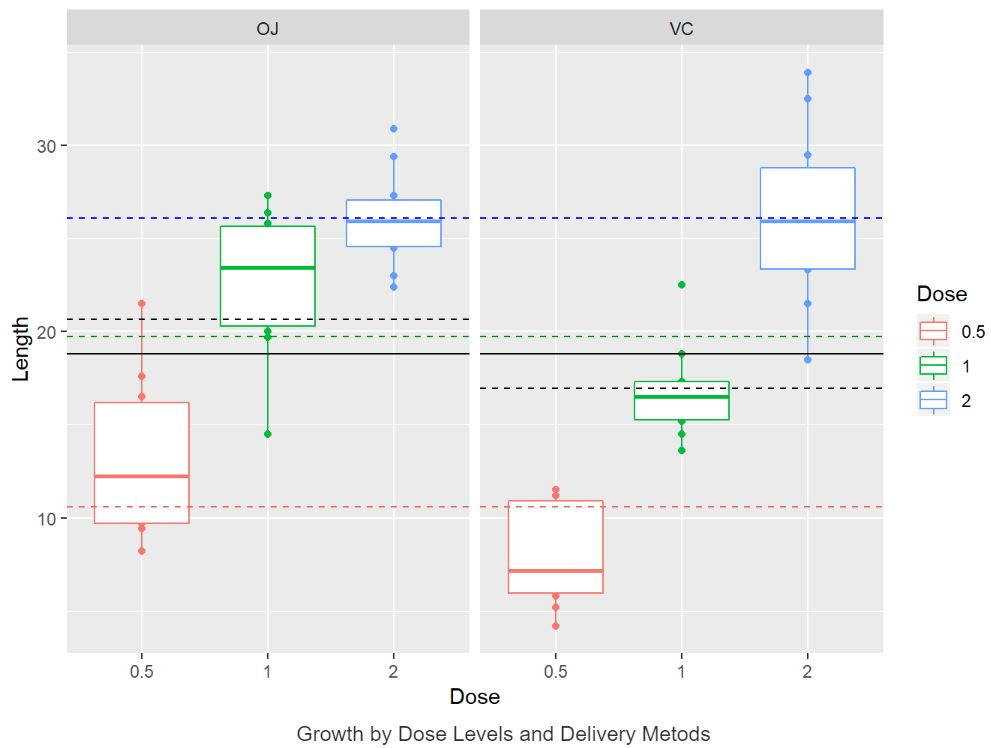

# Analyzing the ToothGrowth Data

In this project, I analyzed the effect of vitamin C in the teeth growth. The data is about the effect of vitamin C on tooth growth in guinea pigs. In this data, the response is the length of odontoblasts (cells responsible for tooth growth) in 60 guinea pigs. Each animal received one of three dose levels of vitamin C (0.5, 1, and 2 mg/day) by one of two delivery methods, orange juice (coded as OJ) or ascorbic acid (a form of vitamin C and coded as VC). The data contains 60 observations with 3 variables.

The following figure represents the relationship between growth length and dose levels categorized by delivery methods. The black solid line represents the mean of growth (i.e., ~18.81) in the whole data. A dashed black line represents the mean of growth for the associated delivery method (i.e., ~20.66 and ~16.96 for methods OJ and VC, respectively). The red, green, and blue dashed lines denote the mean of growth for dose levels 0.5, 1, and 2, respectively (i.e., ~10.61, ~19.73, and ~26.1, respectevily).

Some (interesting) observations from the above figure are as follow: 
- As expected, more dose levels results in more growth. 
- The delivery method OJ has more positive impact on the growth than VC. 
- Almost all growth length for dose level 0.5 (2, respectively) are under (above, respectively) the average growth in the data. 
- Almost all growth length for dose level 1 with delivery method OJ are above the average growth, while this is just the other way round for dose 1 with supplement VC. 
- The average growth for dose level 1 is very close to the overall average growth, while the average growth for dose level 2 (0.5, respectively) is above (under, respectively) of the overall average growth. 

I assumed that our data is iid Gaussian, and our sample of the data is a randomly selected portion of the total population. Then, I took advantage of t-tests to do several hypothesis tests (15 tests). Since I did multiple hypothesis tests on the same data, I adjusted the p-values to understand which results were statistically significant.

The technical reproducible report can be found [here](https://rpubs.com/asaf/toothgrowth).